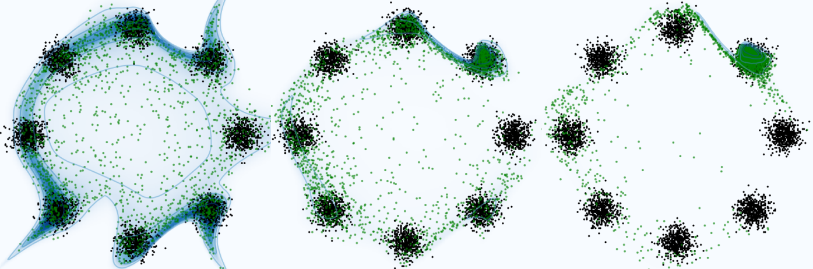
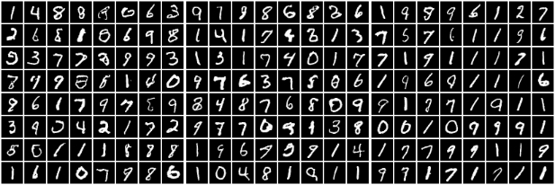
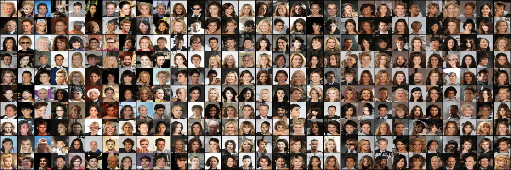

# Precision-Recall BigGAN-PyTorch. 

This repo contains the code to train BigGAN to tackle a user defined Precison-Recall for the paper : [Precision-Recall Divergence Optimization for Generative Modeling with GANs and Normalizing Flows](https://neurips.cc/virtual/2023/poster/71576) by Alexandre Vérine, Benjamin Negrevergne, Muni Sreenivas Pydi and Yann Chevaleyre. It is adapted from the [unofficial PyTorch BigGAN implementation](https://github.com/ajbrock/BigGAN-PyTorch). Please find attached the original [README.md](OriginalREADME.md)

[](https://paperswithcode.com/sota/image-generation-on-mnist?p=precision-recall-divergence-optimization-for)
[](https://paperswithcode.com/sota/image-generation-on-fashion-mnist?p=precision-recall-divergence-optimization-for)
[](https://paperswithcode.com/sota/image-generation-on-imagenet-128x128?p=precision-recall-divergence-optimization-for)

Main add-ons:
- Added different losses to fit the $f$-GAN training in *losses.py*, 
- Added the PR-Divergence primal estimation for training,
- Added evaluation with Precision Recall of [Kynkäänniemi et al.](https://arxiv.org/abs/1904.06991) and [Simon et al.](https://arxiv.org/abs/1905.05441),
- Replaced the log system by *logging*.



Please make sure you follow the instructions in the [original implementation](https://github.com/ajbrock/BigGAN-PyTorch). In particular:
- Prepare the dataset and the different features for evalutation. For instance for CIFAR-10:
```sh
python make_hdf5.py --dataset C10 --batch_size 256  --data_dir ~/data
python calculate_inception_moments.py --dataset C10 --data_root ~/data --batch_size 256	
python calculate_vgg_features.py --dataset C10 --data_root ~/data
python calculate_inception_features.py --dataset C10 --data_root ~/data
```
- Make sure the different models of vgg and inception are downloaded in *~/.cache/torch/hub/checkpoints*. They are necessary to compute the FID, Precision and Recall. The download should be automatic. 
```sh
wget https://download.pytorch.org/models/vgg16-397923af.pth
wget http://download.tensorflow.org/models/image/imagenet/inception-2015-12-05.tgz
wget https://download.pytorch.org/models/inception_v3_google-0cc3c7bd.pth
```
This code is compatible with any dataset composed of jpg or png as the original repository. We added the compatibility ith MNIST.


It is also compatible with CelebA $64\times64$. To do so, follow the intructions in [Real NVP](https://github.com/laurent-dinh/models/blob/master/real_nvp/celeba_formatting.py), also given in *dataset.py*:

```text
  Download img_align_celeba.zip from
  http://mmlab.ie.cuhk.edu.hk/projects/CelebA.html under the
  link "Align&Cropped Images" in the "Img" directory and list_eval_partition.txt
  under the link "Train/Val/Test Partitions" in the "Eval" directory.Then do:
  unzip img_align_celeba.zip
  "

  Subsequently, move the files img_align_celeba.zip and list_eval_partition.txt
  into folder data/celeba/raw/
```



# How to run the code
With this repository, you can train:
- an original BigGAN by using the option *--which_loss vanilla*:
```sh
python train.py \
--which_loss PR --which_div Chi2  --lambda 0.1 \
--shuffle --batch_size 128 --parallel \
--num_G_accumulations 1 --num_D_accumulations 1 --num_epochs 900 \
--num_D_steps 4 --G_lr 2e-4 --D_lr 2e-4 \
--dataset C10 \
--G_ortho 0.0 \
--G_attn 0 --D_attn 0 \
--G_init N02 --D_init N02 \
--ema  --ema_start 1000 --G_eval_mode \
--test_every 5000 --save_every 5000 --num_best_copies 1 --num_save_copies 2 --seed 0
```
- a BigGAN trained as an [$f$-GAN](https://arxiv.org/abs/1606.00709) with the option *--which_loss div* and the option *--which div* to choose the divergence among the Kullback Leibler (*KL*), the reverse Kullback Leibler (*rKL*), the $\chi^2$-Pearon (*Chi2*) or the PR divergence (*PR*): 
```sh
python train.py \
--which_loss div --which_div KL  --lambda 0.1 \
--shuffle --batch_size 128 --parallel \
--num_G_accumulations 1 --num_D_accumulations 1 --num_epochs 900 \
--num_D_steps 4 --G_lr 2e-4 --D_lr 2e-4 \
--dataset C10 \
--G_ortho 0.0 \
--G_attn 0 --D_attn 0 \
--G_init N02 --D_init N02 \
--ema  --ema_start 1000 --G_eval_mode \
--test_every 5000 --save_every 5000 --num_best_copies 1 --num_save_copies 2 --seed 0
```
- a BigGAN trained on the precision recall using the option *--which_loss PR*. You need to declare the auxiliary divergence used to trained the discriminator and used to evaluate the PR-divergence, using the option *--which div*. You need to specify the trade-off parameter *lambda*:
```sh
python train.py \
--which_loss PR --which_div Chi2  --lambda 1 \
--shuffle --batch_size 128 --parallel \
--num_G_accumulations 1 --num_D_accumulations 1 --num_epochs 900 \
--num_D_steps 4 --G_lr 2e-4 --D_lr 2e-4 \
--dataset C10 \
--G_ortho 0.0 \
--G_attn 0 --D_attn 0 \
--G_init N02 --D_init N02 \
--ema  --ema_start 1000 --G_eval_mode \
--test_every 5000 --save_every 5000 --num_best_copies 1 --num_save_copies 2 --seed 0
```

In addition to the original repository, the code can:
- Save the best model using the FID, the precision P, the recall R or P+R using for instance:
 ```sh
--which_best P+R
```
- be easilly compatible with [submitit](https://github.com/facebookincubator/submitit),  using the defined function *run* in *train.py* and *run_sampler* in *sample.py*.
- compute the metrics of any samples of other models using *evaluate.py*. To do so, generate 50k samples in a folder name for instance *stylegan-xl* and run:
```sh
python evaluate.py --dataset C10 --experiment_name stylegan-xl
```

## References and Acknowledgments

If you use this code, please cite:
```text
@misc{verine2023precisionrecall,
      title={Precision-Recall Divergence Optimization for Generative Modeling with GANs and Normalizing Flows}, 
      author={Alexandre Verine and Benjamin Negrevergne and Muni Sreenivas Pydi and Yann Chevaleyre},
      year={2023},
      eprint={2305.18910},
      archivePrefix={arXiv},
      primaryClass={cs.LG}
}
```
and :
```text
@inproceedings{
brock2018large,
title={Large Scale {GAN} Training for High Fidelity Natural Image Synthesis},
author={Andrew Brock and Jeff Donahue and Karen Simonyan},
booktitle={International Conference on Learning Representations},
year={2019},
url={https://openreview.net/forum?id=B1xsqj09Fm},
}
```


Thanks to IDRIS and GENCI for the computational ressources. 

[Precision and Recall](https://github.com/blandocs/improved-precision-and-recall-metric-pytorch) by blandocs.

[PR-Cruves](https://github.com/DrLSimon/precision-recall-distributions-icml19) by Loic Simon.

